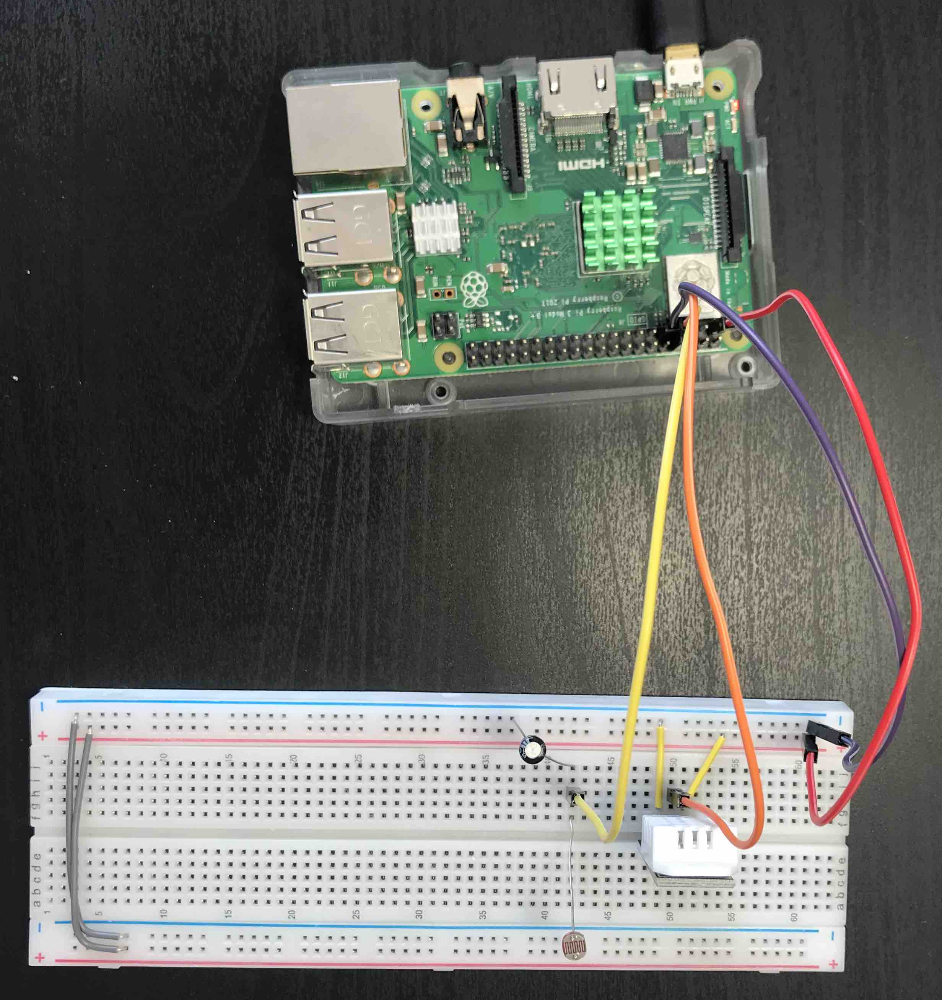
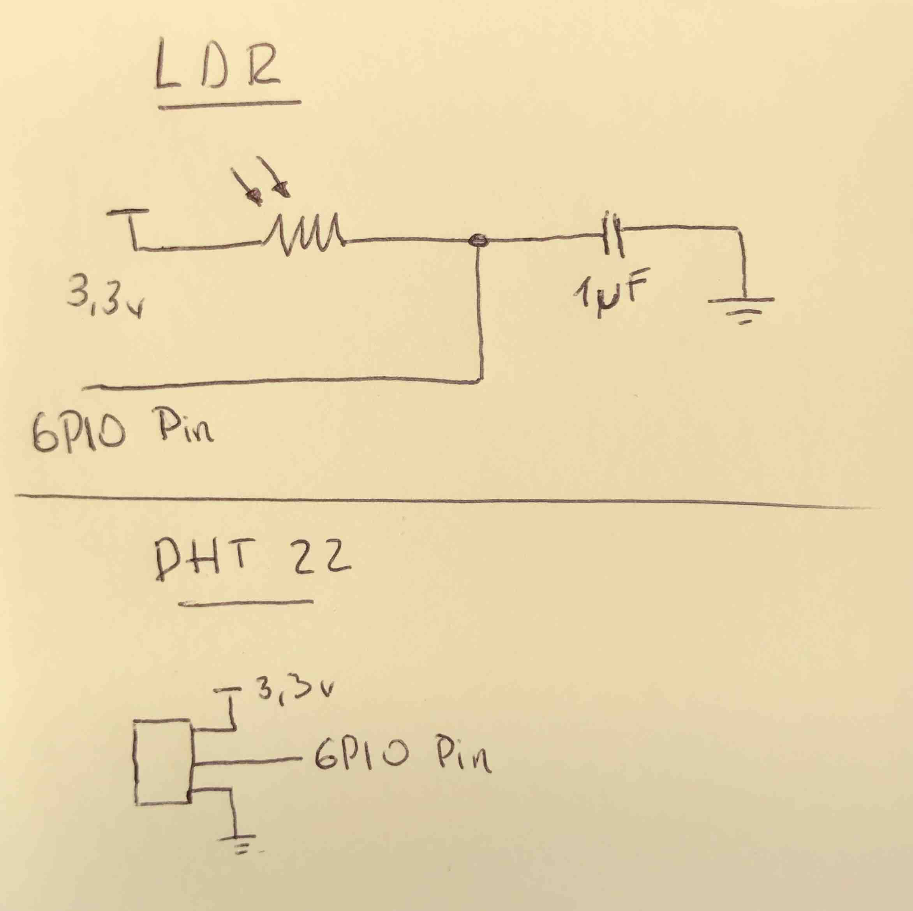

# Weather Station for Raspberry pi

## Install
```
- pip3 install RPI.GPIO
- pip3 install adafruit-blinka
- pip3 install adafruit-io
- pip3 install flask
```

## Run
```
./app.py
```


## Circuit

## Diagram

